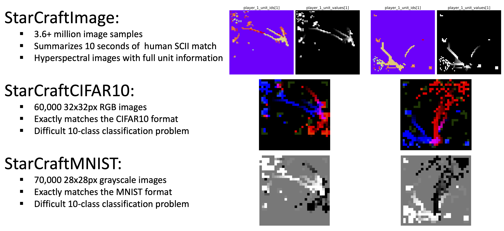

# StarCraftImage Dataset (Forked)

Welcome! This is the repository for the StarCraftImage dataset from the paper: [StarCraftImage: A Dataset For Prototyping Spatial Reasoning Methods For Multi-Agent Environments](https://openaccess.thecvf.com/content/CVPR2023/html/Kulinski_StarCraftImage_A_Dataset_for_Prototyping_Spatial_Reasoning_Methods_for_Multi-Agent_CVPR_2023_paper.html)




## Quickstart

There are three main StarCraftII datasets. 
Each dataset includes images summarize a 10 second window (255 frames) of a StarCraftII replay.

1. `StarCraftImage`: This is the main 3.6 million sample dataset which includes multiple image formats:`'sparse-hyperspectral'`, `'dense-hyperspectral'`, `'bag-of-units'`, `'bag-of-units-first'`, and contains all unit positioning information throughout the window.
This dataset can be used via the following:

    ```py
    from sc2image.dataset import StarCraftImage
    scimage = StarCraftImage(root_dir=<your_download_path>, download=True)
    ```

    This will download the StarCraftImage dataset to the `<your_download_path>` directory (if it does not already exist there).
As this dataset has over 3.6 million samples, this might take a while to download. However, you can use the standalone StarCraftCIFAR10 and StarCraftMNIST versions below.


2. `StarCraftCIFAR10`: This is a simplified version of the `StarCraftImage` dataset which exactly matches the setup of the CIFAR10 dataset.
All images have been condensed into a three channel (RGB) image where the Red channel corresponds to Player 2 units, Green correspond to neutral units, and Blue to Player 1 units.
The 10 classes equate to: `(map_name, did_window_happen_in_first_half_of_replay)`.
The dataset can be loaded via:
        
    ```py    
    from sc2image.dataset import StarCraftCIFAR10
    scimage_cifar10 = StarCraftCIFAR10(root_dir=<your_download_path>, download=True)
    ```

 3. `StarCraftMNIST`: This is a further simplified version of the `StarCraftImage` dataset which exactly matches the setup of the MNIST dataset. 
 The grayscale images show to the seen last seen timestamps for units each pixel location, and the 10 classes match that of `StarCraftCIFAR10`.
 The dataset can be loaded via:

    ```py
    from sc2image.dataset import StarCraftMNIST
    scimage_mnist = StarCraftMNIST(root_dir=<your_download_path>, download=True)
    ```
    
## Example uses
Please see the `starcraftimage-quickstart` jupyter notebook in the `dataset-demos` folder to see details on using this dataset!

## Citation
If you use this dataset, please cite the following paper:
```
@inproceedings{kulinski2023starcraftimage,
  title={StarCraftImage: A Dataset for Prototyping Spatial Reasoning Methods for Multi-Agent Environments},
  author={Kulinski, Sean and Waytowich, Nicholas R and Hare, James Z and Inouye, David I},
  booktitle={Proceedings of the IEEE/CVF Conference on Computer Vision and Pattern Recognition},
  pages={22004--22013},
  year={2023}
}
```

If you run into any issues, please feel free to open an issue in this repository or email us via the corresponding author email in the [main paper](https://openaccess.thecvf.com/content/CVPR2023/html/Kulinski_StarCraftImage_A_Dataset_for_Prototyping_Spatial_Reasoning_Methods_for_Multi-Agent_CVPR_2023_paper.html).

Cheers!
